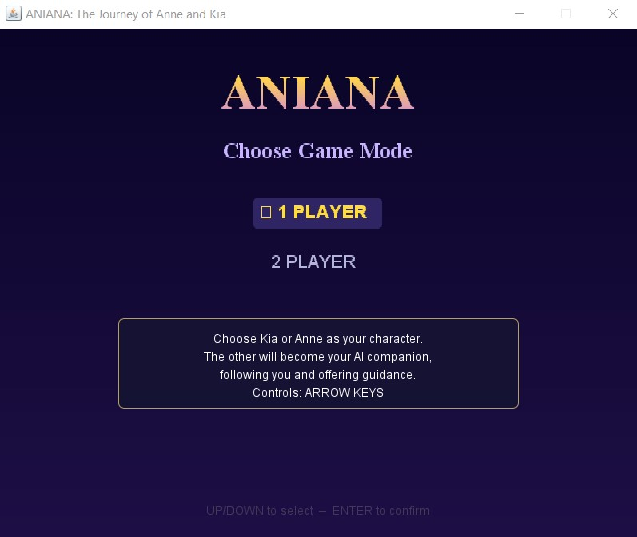
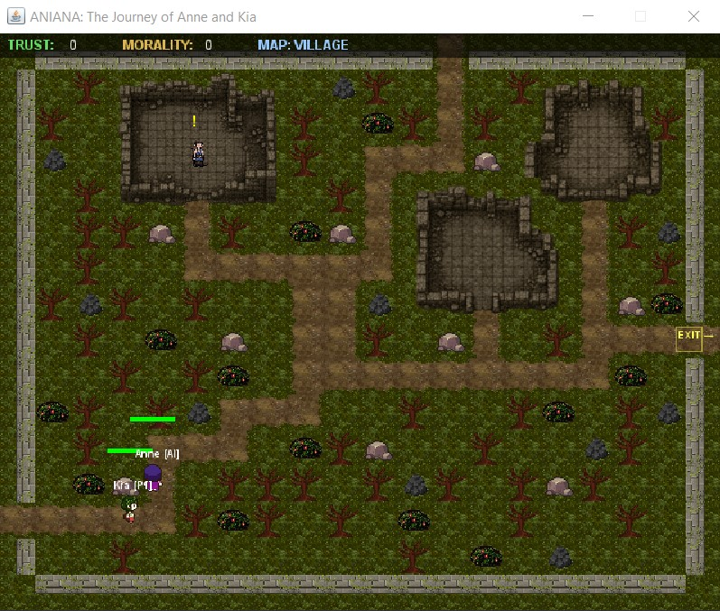
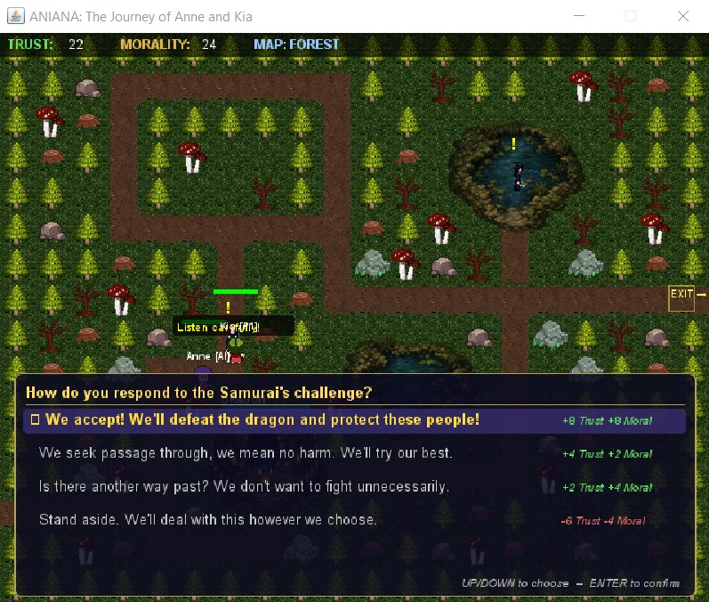

# 🎮 ANIANA – The Journey of Anne and Kia

> A story-driven trust system game where player choices influence relationships and shape the journey of Anne and Kia.

## 📥 Download & Play

**[Download ANIANA for Windows](../../releases/latest)**

1. Download `ANIANA.zip` from the latest release.
2. Extract the ZIP file.
3. Open the extracted `ANIANA` folder.
4. Double-click `ANIANA.exe`.
5. Enjoy the game!

---

## 📖 About the Game

**ANIANA: The Journey of Anne and Kia** is a Java-based trust system game centered around the journey of two characters, Anne and Kia.

The game explores how player interactions and decisions can affect the level of trust between the characters.

The project focuses on implementing a functional trust-based gameplay system combined with an interactive, story-driven experience.

---

## 📸 Screenshots

### Main Menu



### Gameplay



### Dialogue



---

## 🎮 Gameplay & Features

- 💜 Trust-based interactions
- 💬 Dialogue and story progression
- 🎯 Player choices that affect trust
- 🗺️ Tile-based environments
- 🎵 Background music and audio
- 🎨 Custom game assets
- 📖 Story-driven gameplay

---

## 🛠️ Technologies Used

| Technology | Purpose |
|---|---|
| **Java** | Core game logic and programming |
| **Maven** | Project and dependency management |
| **Tiled** | Tile maps and game environments |
| **NetBeans** | Development environment |
| **Git & GitHub** | Version control and project distribution |

---

## 🧩 Key Systems

### Trust System

The core gameplay mechanic is a trust system that allows player interactions and decisions to influence the relationship between Anne and Kia.

### Dialogue System

Dialogue and interactions are used to progress the story and present different situations to the player.

### Tile-Based Maps

Game environments are created using Tiled and integrated into the Java application.

### Audio System

The game includes background music and audio integrated into the gameplay experience.

---

## 👩‍💻 My Contributions

My contributions to the project included:

- Designing and integrating Tiled maps into the game
- Developing and debugging gameplay interactions
- Implementing the background music system
- Testing and troubleshooting the application
- Packaging the game into a standalone Windows application

## 🏗️ Project Structure

```text
ANIANA-Trust-System-Game/
├── src/          # Java source code
├── lib/          # Project libraries
├── pom.xml       # Maven configuration
├── README.md     # Project documentation
└── .gitignore
```

## 🚀 Running from Source

### Requirements

- Java JDK 25
- Apache Maven
- NetBeans (recommended)

### Steps

1. Clone the repository:

   ```bash
   git clone https://github.com/YOUR-USERNAME/ANIANA-Trust-System-Game.git
   ```
   
2. Open the project in NetBeans.
3. Allow Maven to load the required dependencies.
4. Build the project.
5. Run the application.

## 🎓 Project Information

ANIANA was developed collaboratively as part of an academic game development project to apply and demonstrate the programming concepts and skills learned throughout the Intermediate Programming course using NetBeans and Java.

## 📄 License

This project is for educational and portfolio purposes.
